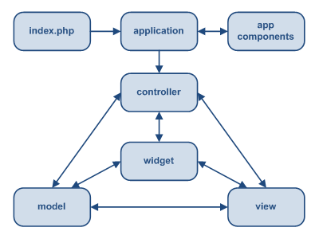

## UNIVERSIDADE FEDERAL DO RIO GRANDE DO SUL
#### INF01003 - Engenharia de Software II (Marcelo Pimenta).
---------------
- Guilherme Severo
- Eduarto Potter


### Memento


Memento é uma design pattern descrita no livro Design Patterns: Elements of Reusable Object-Oriented Software.
Às vezes, pode ser que precisemos capturar o estado interno de um objeto, para que ele possa ser recuperado mais tarde. Se quisermos, por exemplo, implementar uma ação de desfazer em um classe calculadora. Armazenar as informações para isso no próprio objeto seria muito custoso, além de que diversos métodos precisariam ser incluidos na classe, aumentando muito o seu tamanho. Podemos fazer então uma classe para gerenciar essas operações de desfazer. Entretanto, se dermos acesso aos estados internos da classe calculadora para a classe que seria responsável por guardar o estado interno, estamos violando o encapsulamento. É isso que o memento se propõe a resolver. Ou seja, ele possibilita salvar o estado interno de um objeto, sem quebrar o encapsulamento, através de uma classe memento.
Nesse design pattern. nós temos três classes, a caretaker, responsável por comunicar-se com o memento, a classe cujo estado queremos salvar, que vamos chamar de originator, e a classe memento, que é responsável por gerenciar o estado.
· Memento (SolverState) 
Armazena o estado interno (todas as informações necessárias)da classe originator. 
Proteje contra acesso de objetos que não sejam o originator
Mementos tem duas interfaces. O caretaker pode apenas passar o memento para outros objetos. O originator, entretanto, ve uma interface larga, que permite acesso a todos os dados necessários para que ele volte a um estado anterior.

#### Originator 
Cria um memento contendo um snapshot de seu estado interno atual. 
Usa o memento pra voltar a um determinado estado atual.

#### Caretaker
Responsável por gerenciar a existêcia do memento.
Não modifica ou examina o conteúdo do memento

Diagrama de classes para um memento:


Figura 01

Um exemplo de aplicação de um memento é em banco de dados. Transações de dados ocorrem atomicamente. Entretanto, uma transação pode conter mais de uma informação sobre um banco. Com isso, de uma das operações falha, pode ser necessário que um rollback seja feito, restaurando o banco para o estado inicial. Isso pode ser feito através da solicitação de um momento antes de as operações começarem a ser executadas.

### Front Controller


Front controller é um design pattern muito utilizado na construção de sistemas web. A idéia por trás do front controller é bem simples.  Ele é basicamente um ponto de entrada centralizado para todas as requisições feitas. Mesno sendo usualmente utilizado para web, ele também poderia ser utilizado para aplicações desktop comuns.

A vantagem está no fato de que em um sistema web, muitas coisas precisam ser feitas para todas as requisições. Ao utilizarmos um único handler para todas as requisições, evitamos que o código seja replicado diversas vezes, mas também podemos ter execuções específicas para requisições, o que torna o código muito melhor. Além disso, podemos com isso utilizar o conceito de views, isto é, separar a perte de aprsentação da lógica de processamento.

<br>

Figura 02


### Socket.io

Socket.io é uma biblioteca javascript para a criação de sockets web persistentes e não bloqueantes. Normalmente é usado como um componente do NodeJS e é usado principalmente para aplicações web em tempo real como chats, jogos, etc. Basicamente, tem duas partes, uma parte que roda no lado do cliente, e outra parte que roda no servidor. Ambos componentes tem uma API praticamente idêntica. Suas principais características são programação orientada a eventos, funções de entrada e saída não bloqueante, oferece transparência entre os diferentes mecanismos de transporte que existe nos variados navegadores web. 


### Yii Framework


Yii é um framework MVC de código aberto, orientado a objetos em PHP que utiliza componentes para o desenvolvimento de grandes aplicações Web. Permite máxima reutilização de códigos na programação Web e pode acelerar significativamente o processo de desenvolvimento. O nome Yii (pronunciado i) representa as palavras fácil (easy), eficiente (efficient) extensível .
Yii utiliza um FrontController para gerenciar as requisições e dar início ao aplicativo no modelo MVC.
Na imagem a seguir podemos observar a estrutura MVC que o framework nos disponibiliza. Nota-se que o arquivo index.php server de ponto de acesso a aplicação web, caracterizando assim o padrão Front Controller.

<br>

Figura 03

### Exemplo de Aplicações


#### Front Controller
Em nosso exemplo de Front Controller nós criamos uma aplicação web com a ajuda do framework Yii PHP. Como descrevemos anteriormente o Yii utiliza o arquivo index.php como Front Controller. Podemos observar como isto é feito no trecho de código a seguir.

```php
date_default_timezone_set('America/Sao_Paulo');

// change the following paths if necessary
$yii=dirname(__FILE__).'/../yii/framework/yii.php';
$config=dirname(__FILE__).'/protected/config/main.php';

// remove the following lines when in production mode
defined('YII_DEBUG') or define('YII_DEBUG',true);
// specify how many levels of call stack should be shown in each log message
defined('YII_TRACE_LEVEL') or define('YII_TRACE_LEVEL',3);

require_once($yii);
Yii::createWebApplication($config)->run();

```
Figura 04

A partir do método estático createWebApplication da classe Yii, como é mostrado na Figura 04,  é que de fato temos todo o workflow mostrado na Figura 03. Todo o cliente conectado ao servidor obrigatoriamente passa por esta parte do código.  

#### Socket IO
Neste exemplo usamos uma aplicação feita por Guilherme Severo e Cláudio Busato para a cadeira de Sistemas Operacionais II. A aplicação é uma simplificação do jogo  Imagem e Ação. No qual um jogador desenha no navegador e os outros tem que adivinhar o que esse está desenhando. No caso do jogo o desenho acontece em tempo real para todos os jogadores. Neste caso o socket.io foi utilizado para fazer uma conexão persistente com todos os jogadores. Como é orientado a eventos, a cada evento de desenho do usuário X os uruários Y1, Y2, …, Yn recebem a atualização da tela e percebem o que o usuário X está desenhando.
O trecho de código a seguir demonstra como o servidor se comporta a cada evento do usuário X.

```javascript
    /**
    * *************************************************************************
    * Eventos de desenho
    * *************************************************************************
    */
     
    //Troca a cor do desenho 
    socket.on('changeColor', function (data) {
        socket.broadcast.emit('changeColor', data)
    })

    //Troca o tamanho do pincel
    socket.on('changeBrush', function (data) {
        socket.broadcast.emit('changeBrush', data)
    })

    //desenha um pixel
    socket.on('drawPixel', function (data) {
        socket.broadcast.emit('drawPixel', data)
        paint.push(data)
    })

    //limpa o desenho atual
    socket.on('clearCanvas', function (data) {
        paint = []
        socket.broadcast.emit('clearCanvas', data)
    })
```
Figura 05

Podemos observar que a cada evento que o servidor recebe de um jogador X ele dispara um broadcast (mensagem para todos conectados) para todos os outros jogadores. Assim, cada jogador recebe a atualização do desenho. 
Conclusão

Vimos que com a utilização dos padrões de projeto propostos podemos alcançar alta capacidade de reuso de código. Seguindo os padrões podemos obter uma curva de aprendizagem muito mais robusta e o desenvolvimento de software cada vez mais confiável e rápido.

#### Bibliografia  e Referências

* Design Patterns Elements of Reusable Object-Oriented Software 
 Erich Gamma, Richard Helm, Ralph Johnson e John Vlissides

* http://www.oodesign.com/memento-pattern.html

* http://sourcemaking.com/design_patterns/memento

* http://en.wikipedia.org/wiki/Front_Controller_pattern

* http://www.tutorialspoint.com/design_pattern/front_controller_pattern.htm

* http://www.yiiframework.com

* http://socket.io/

* http://nodejs.org/

* https://github.com/GuiSevero/iaction

* https://github.com/GuiSevero/INF01003_T2
